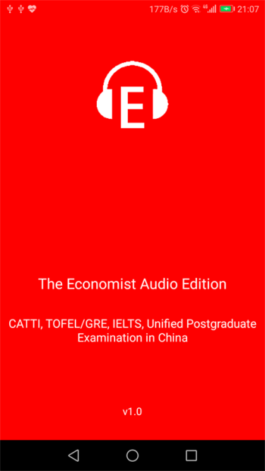
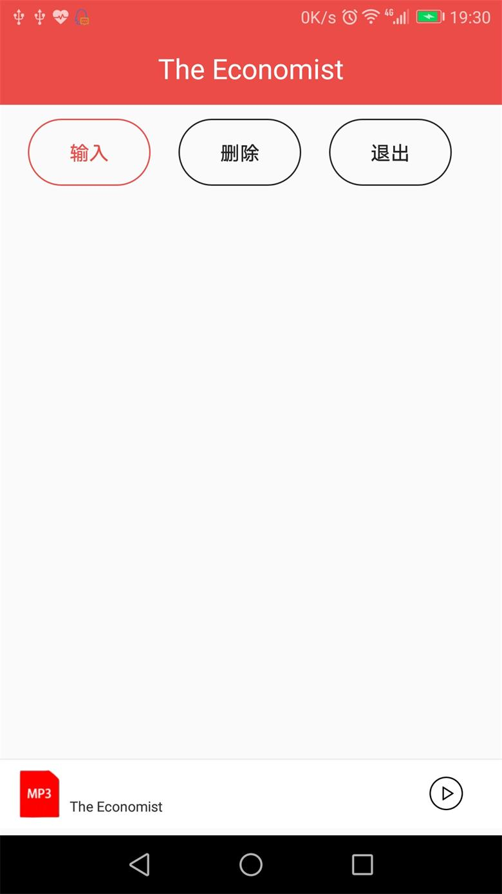
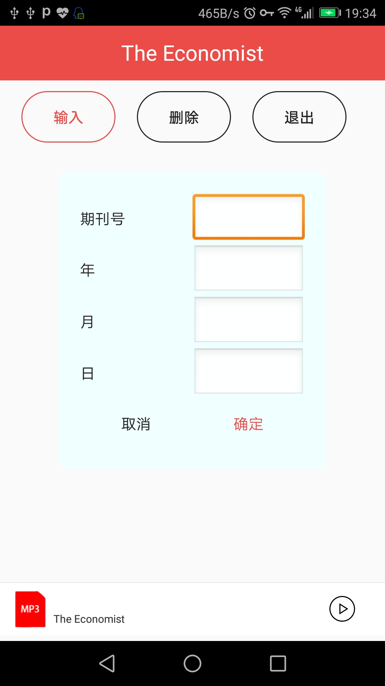
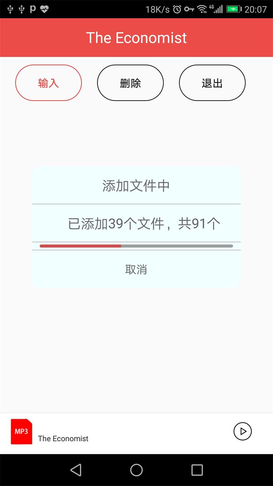
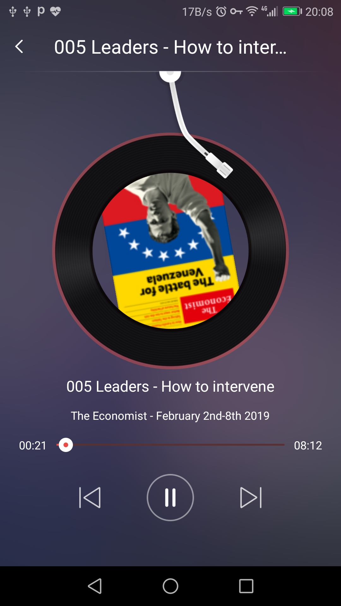

# The Economist Audio Downloader

Provide an app for advanced english learners.

You can download the Audio Edition of The Economist.

The target users are CATTI, Unified National Graduate Entrance Examination in China, MTI, IETLS and TOEFL/GRE etc.

核心库来自[WlMedia](https://github.com/wanliyang1990/wlmedia)，由[ywl5320](https://github.com/wanliyang1990)提供。在此表示衷心的感谢。

### Splash Input

 

### Download

### Add Files Listening

 

#### 本项目自确认完成开发起，提供3年底层so文件更新的维护功能。

如果这个项目帮助到了你，或对你的技术开发有帮助，欢迎赏一份茶水钱。

 
